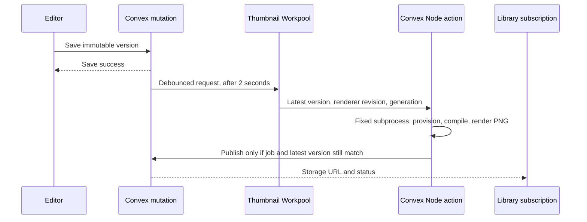

# Server-rendered effect thumbnails

Saved WGSL effects receive asynchronous, deterministic library-card images.
Scene thumbnails are outside this feature. JavaScript and TypeScript effects
retain browser capture/upload; authored scripts never execute in the Node action.

## Architecture

`createEffect` and `saveVersion` retain their existing arguments and return values.
Shader saves commit the immutable version and record a thumbnail request in the
same transaction. The editor reports success immediately, without capture/upload.



- `shared/effectShaderContract.ts` is the existing browser shader contract moved
  into a browser-independent module. The old import path re-exports it.
- `shared/effectThumbnail.ts` packs aligned WebGPU uniforms with the existing
  saved-default parameter helpers. Revision 1 uses 640×360 opaque PNG, time 1s,
  center (320,180), radius 136.8px, rotation 0, the preview's dark grid, and a
  white map texture. Coverage receives the same treatment as the preview: no
  lighting mask or scene geometry. No animation warm-up runs.
- `convex/lib/thumbnailRuntime.ts` is the Node adapter. `vgpu/node` is imported
  only in this backend module, used by the thumbnail and diagnostic actions.
- `effectThumbnails`, indexed by effect ID, separates requested version/revision,
  work ID/generation, status, attempts, scheduling times, and last successful
  storage/version from immutable `effectVersions`.
- `thumbnails.dispatch` feeds a dedicated Workpool with concurrency 2. An effect
  has at most one active work item and one render start per minute. Rapid saves
  move the requested version and the two-second deadline. Obsolete queued jobs
  skip rendering; active obsolete jobs discard their output and queue the latest.
- Only initialization and storage failures retry, up to three total attempts,
  with 60s then 120s delays. Invalid WGSL, device loss, and render deadlines are
  terminal. A new saved version gets a fresh attempt budget.
- Publication checks effect existence, actual latest version, requested version,
  renderer revision, and job generation. Duplicate claims/completions are safe.
  Rejected and replaced files are deleted; deleting an effect deletes its accepted
  generated file. Workpool completion resolves failed/canceled jobs.
- Authorized library queries resolve storage IDs on read. Generated image →
  legacy image → glyph is the selection order; image-load failure shows the glyph.
  A successful old image stays visible during pending/failed replacement. Cards
  do not create GPU previews. Completion never changes effect `updatedAt`.

## Native runtime and deployment gate

The deployed development environment on 2026-09-07 is Linux ARM64, Node 24.18.0.
Pinned dependencies: `vgpu@0.4.0`, `pngjs@7.0.0`, `tar@7.5.22`, externalized in
`convex.json`. Workpool 0.3.0 supports the project's existing Convex version.

Stock vgpu provisioning failed because Convex lacks `/usr/bin/tar` and Vulkan
system libraries. The fixed subprocess therefore extracts the official Mesa
archive with the JS tar package, uses the pinned vgpu adapter's archive/file
checksum verification, and accepts only its two expected regular files. It
downloads Mesa 25.0.7 / LLVM 19.1.7 from the official vgpu release, then calls
`init({ adapter: "software" })`. Downloads and native cache are disposable.

Five checksum-verified ARM64 shared libraries are embedded as compressed backend
assets: Vulkan loader, libdrm, zlib, zstd, and libudev. They are unpacked into a
private temporary directory, supplied through the child's `LD_LIBRARY_PATH`, and
removed afterward. The child receives no Convex/Clerk/UploadThing credentials.
The host OS is not modified. See [native notices](native/README.md).

The fixed runner receives shader data through JSON stdin, never shell interpolation
or authored JavaScript evaluation. Each subprocess has a 60-second deadline and a
2 MiB output cap; termination waits for process closure before releasing capacity.
Native resources are disposed on success/failure, and the OS reclaims them after
forced termination. Provisioning and rendering use separate bounded subprocesses.

This implementation intentionally supports the verified Linux ARM64 environment.
A different architecture fails generation safely. Re-run the gate after changing
Convex's Node runtime, vgpu, native libraries, or renderer revision. The adapter's
private provisioning API is pinned to vgpu 0.4.0 and must be reviewed on upgrades.
No other hosting service is used.

## Operation

Deploy to development first, with generation absent/disabled, then run:

```sh
bunx convex run thumbnailDiagnostics:probe '{"effects":true,"timeoutRecovery":true,"freshCache":true}'
```

The diagnostic verifies cold provisioning, termination of a live native renderer
using a shortened five-second test deadline, device loss, malformed WGSL, then
valid rendering immediately afterward. Production render deadlines remain 60s.
All decoded output must be 640×360 with opaque alpha. Images are discarded by
default; add `"retainImages":true` only when inspecting/comparing output.

Enable only after this gate passes:

```sh
bunx convex env set EFFECT_THUMBNAILS_ENABLED true
bunx convex run thumbnails:backfill '{}'
```

Backfill examines 25 effects per page and queues only each latest shader version,
including curated starters. Repeat with `{"cursor":"RETURNED_CURSOR"}` until
`done` is true. Backfill uses the same throttle, queue, and job guards as saving.
Run it after re-enabling the flag to pick up versions saved while disabled.

To stop new generation:

```sh
bunx convex env set EFFECT_THUMBNAILS_ENABLED false
```

Existing images remain readable and saves keep working. In-flight jobs cannot
publish while the flag is disabled. Increment `THUMBNAIL_SPEC.revision` and rerun
backfill for deliberate visual changes. Do not rewrite `effectVersions`.

Logs `effect_thumbnail` and `effect_thumbnail_failed` include effect/job identity,
version, attempt, duration, adapter/memory on success, and failure category.
Authored source is not logged. Watch duration, failure rates/categories, pending
work, and memory; disable generation if failures rise.
Use thumbnail statuses and `effect_thumbnail_failed` for failure monitoring:
Workpool counts a handled failure result as a successful action invocation.

## Verification record

- Deployed fixture, repeated renders, cold provisioning, termination recovery,
  device loss and invalid WGSL recovery passed. A fresh-cache five-fixture probe
  including recovery completed in 36.2 seconds; observed queued jobs took 5–12s.
- Child peak RSS was approximately 200–241 MiB; observed parent+child peak RSS sums
  were approximately 350–375 MiB, below the 512 MiB Node limit. These are observed
  fixtures, not a memory guarantee for every authored shader.
- The root deployment code plus source maps measured 3,739,838 bytes (1,361,827
  bytes when gzip-compressed per file), below the 32 MiB source limit. Embedded
  native libraries total 1,564,048 bytes, compressed to 690,070 bytes before
  base64 encoding. Convex accepted installation of the pinned external packages;
  its CLI did not report the exact external-package archive size separately.
- Deployed storage/backfill passed for all five existing shader effects; the
  curated script starter retained its browser path. Production was not deployed.
- The browser comparison page at `/tests/thumbnail-preview.html` renders the
  actual Pixi WebGPU preview contract at 1s. Call `window.compareThumbnails(urls)`
  with the five diagnostic URLs in returned order. Glow, portal, normal/additive
  parameters, white-map sampling and transparency passed: mean channel errors
  0.0065, 0.0027, 0.2130, 0.0660, and 0 on the 0–255 scale. The comparison excludes
  grid line edges where MSAA differs and tolerates quad-edge antialiasing. It uses
  the opaque live canvas; transparent Pixi texture extraction has different alpha.
- `scripts/verify-thumbnail-jobs.mjs` exercises development-only save → failure →
  two rapid valid saves → latest generated image, preserves the previous image
  and library ordering, and deletes its temporary private effect afterward.
- Public cards loaded generated storage images without creating canvases; an
  induced image-load error replaced the image with a glyph, and selecting a card
  retained the interactive detail preview. Authenticated
  editor save → reactive card update still needs a signed-in browser session; none
  was available during this run. Confirm Clerk's `convex` JWT template and issuer
  match the deployment; CLI identity checks do not substitute for this remaining
  browser check.

After rebasing onto current `pre-prod`, the local suite passed 51 tests / 277 assertions. Lint, application/Convex TypeScript
checks, and the production build passed. The build retains its existing large-chunk
warning; no production optimization was removed.

Run the workshop tests, lint, application/Convex TypeScript checks and the production
build with React Compiler enabled. If the local npm/Bun command wrappers stall,
invoke the installed compiler directly with `node node_modules/typescript/bin/tsc`
(`-b` for the application and `--noEmit -p convex/tsconfig.json` for Convex), followed
by `node node_modules/vite/bin/vite.js build`; the production optimizations remain.

References: [vgpu Node rendering](https://vgpu.sh/docs/get-started/node),
[Convex bundling limits](https://docs.convex.dev/functions/bundling),
[Convex runtime limits](https://docs.convex.dev/production/state/limits),
[Convex Workpool](https://github.com/get-convex/workpool).
